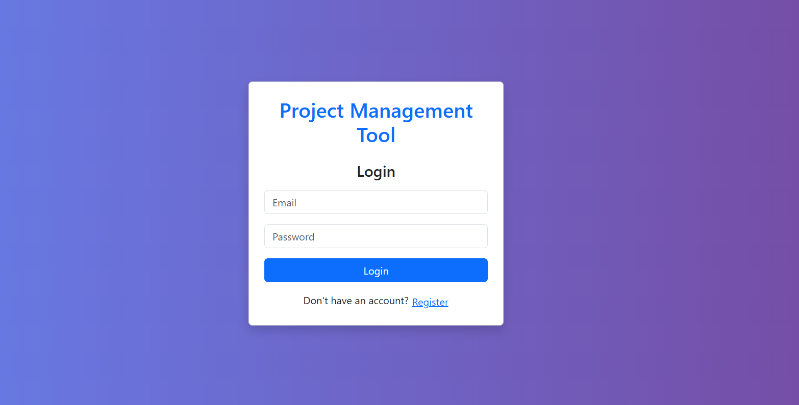
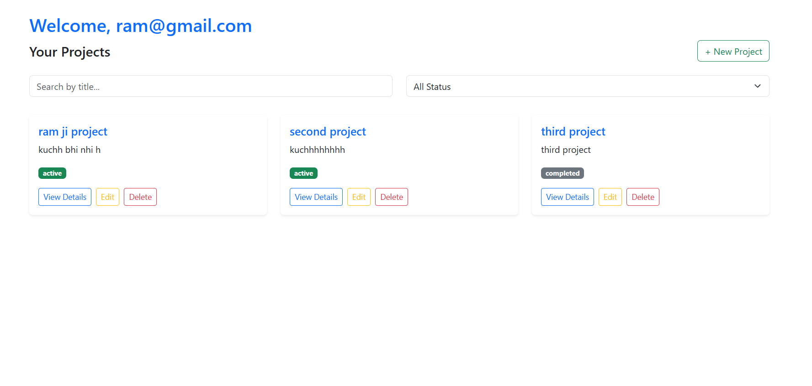
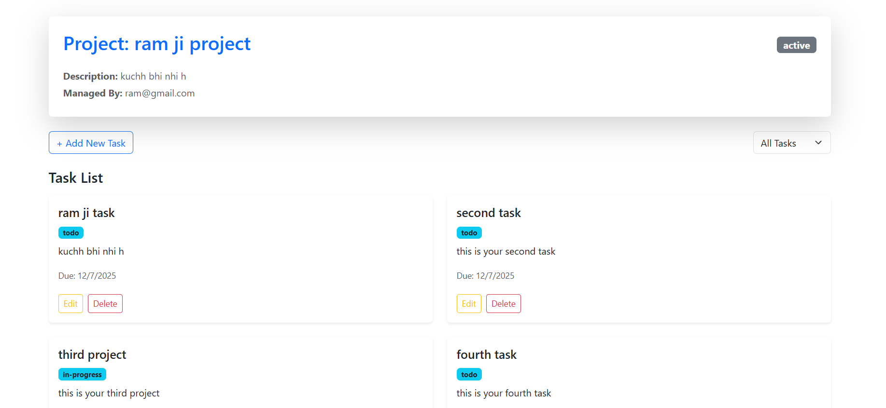

#  Project Management Tool (frontend)

A modern and responsive web application for managing projects and tasks efficiently.  
Built using **React**, **TypeScript**, **Redux Toolkit**, **React Hook Form**, and styled with **Bootstrap **.

---

##  Features

-  User authentication (Login/Register with JWT)
-  Authenticated user dashboard
-  Create, edit, and delete projects
-  Add, edit, delete tasks for each project
-  Search projects by title
-  Filter tasks by status (To Do, In Progress, Done)
-  Clean, responsive, and user-friendly UI

---

##  Screenshots

###  Login/Register Page  


###  Project Dashboard  


###  Project Details with Tasks  


---

## ⚙ Tech Stack

- **Frontend**: React + TypeScript  
- **State Management**: Redux Toolkit + RTK Query  
- **Form Handling**: React Hook Form + Yup  
- **Styling**: Bootstrap   
- **Auth**: JWT stored in Redux + localStorage 

---

##  Getting Started

> **Note:** Make sure your backend server is running at **http://localhost:9000** before starting the frontend application.

###  Clone the Project 

```bash
https://github.com/pandeykrishna20/Project-Management-Tool-_Frontend.git
cd Project-Management-Tool-_Frontend


##  Running the Server
     ->  First Install dependency
               npm install
     -> Run the following command
               npm start


